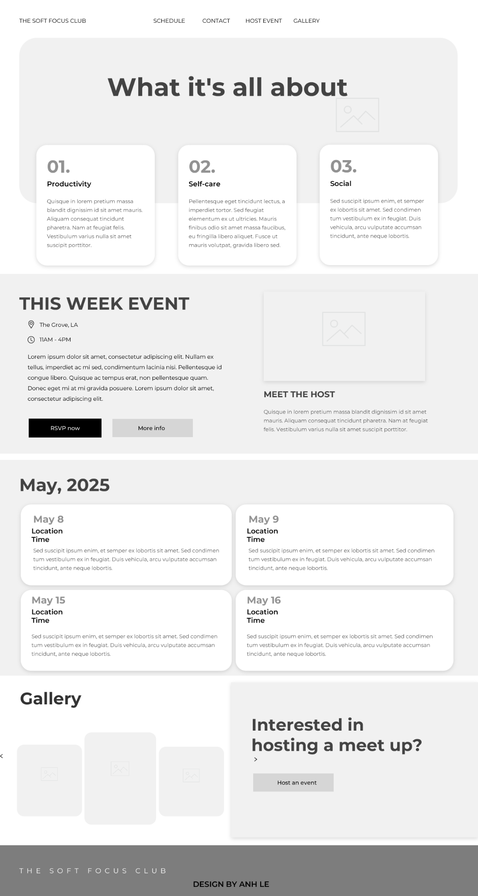

# 🌿 Soft Focus Club – UX/UI Case Study  
**Designed by Anh Le | CodePath Web101 Prework**

---

## Overview

**Soft Focus Club** is a recurring co-working and self-care event for students, creatives, and remote workers. This project explores how intentional UX design can create a calming, supportive digital experience for users who seek productivity without pressure.

The website serves as a low-maintenance landing page where users can view the weekly event schedule, explore upcoming gatherings, and find information on how to host their own sessions. It’s optimized for neurodivergent users and anyone prone to burnout — using soft visuals, simple navigation, and a content-first layout.

---

## Problem

Many productivity-focused events feel high-pressure or rigid, which can discourage neurodivergent or burnout-prone individuals from participating. Users need a space that encourages soft accountability, focus, and social connection — without being overstimulating or demanding.

---

## Goal

Design a visually calm, content-rich homepage that:
- Introduces the event concept clearly
- Supports discovery of this week’s meetup
- Offers a preview of future sessions
- Encourages users to host or participate
- Remains low-pressure, intuitive, and inclusive

---

## Target Audience

- Remote workers, freelancers, and creatives
- College students and young professionals
- Neurodivergent individuals (ADHD, autism, anxiety)
- Anyone seeking productivity without burnout

---

## Design Approach

The homepage follows a **gentle scroll-based layout** with predictable rhythm and spacing. The interface avoids clutter and color overload, using clear typographic hierarchy and a grayscale palette with subtle accents. Every section is self-contained and labeled for quick comprehension.

---

## Information Architecture

1. **Hero Section**  
   Title and value proposition — "What it’s all about"  
   Three core pillars: Productivity, Self-care, and Social connection

2. **This Week’s Event**  
   Location, time, and RSVP options for the upcoming event

3. **Meet the Host**  
   A personal introduction to humanize the experience

4. **Monthly Schedule**  
   A horizontal scroll of upcoming events by date

5. **Gallery & Hosting Invitation**  
   Inspiration from previous sessions and a CTA to host your own meetup

---

## Design Decisions

- **One-page structure**: Minimal navigation required, perfect for mobile and neurodivergent users  
- **Neutral, calming color palette**: Avoids overstimulation and supports accessibility  
- **Readable font sizes and spacing**: Enhances clarity for users with sensory sensitivity  
- **Low-friction RSVP and contact buttons**: Reduces anxiety around engagement  

---

## Tools Used

- Justinmind (for wireframing and visual layout planning)  
- GitHub Codespaces + HTML/CSS (static site implementation)

---

## Wireframe Preview

> Built as a static responsive site and published on GitHub Pages.

---

## Outcome

The Soft Focus Club homepage serves as a gentle invitation into a community-focused productivity space. Its layout, design decisions, and content structure prioritize inclusivity, simplicity, and calm — reflecting the event’s values in every UI detail.

---

**View the live site:**  
🔗 https://681e7a45941c4cd22cef4fa1--cerulean-naiad-8e358e.netlify.app/
